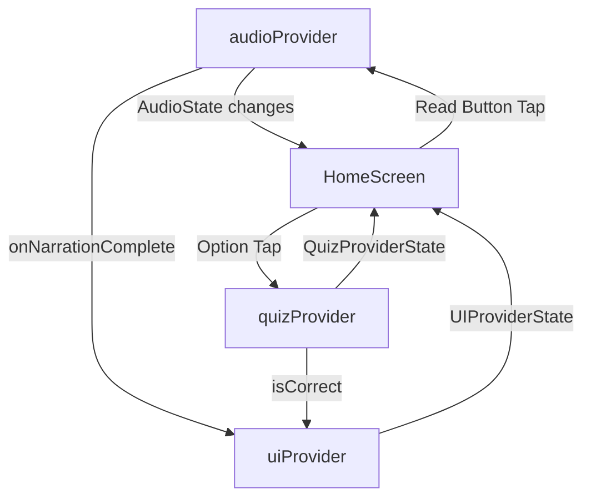
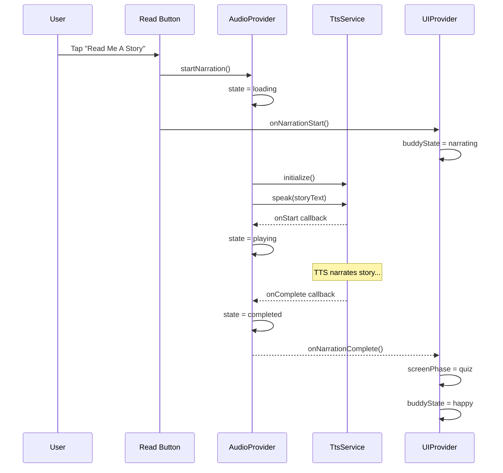
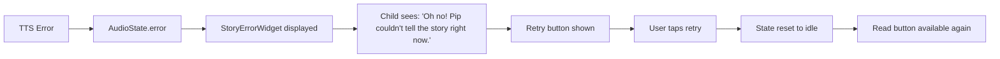
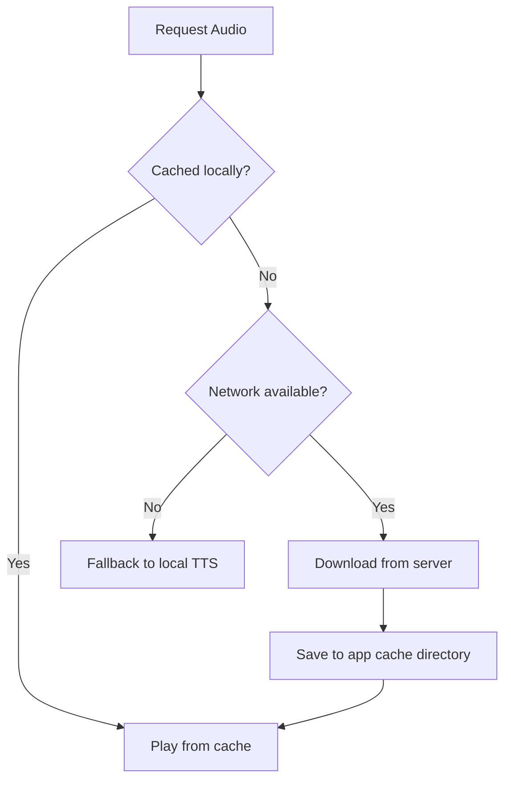

# 🤖 Peblo Story Tales — AI Story Buddy & Quiz Component

> A child-friendly Flutter application where an AI buddy named **Pip** narrates an interactive story using Text-to-Speech and then presents a data-driven quiz to test comprehension.


---

## 📋 Table of Contents

- [Project Overview](#project-overview)
- [Why Flutter](#why-flutter)
- [Architecture](#architecture)
- [State Management](#state-management)
- [Audio Flow](#audio-flow)
- [Data-Driven Quiz](#data-driven-quiz)
- [Loading States](#loading-states)
- [Failure States](#failure-states)
- [Caching Strategy](#caching-strategy)
- [Performance Profiling](#performance-profiling)
- [Mid-Range Android Optimization](#mid-range-android-optimization)
- [Getting Started](#getting-started)
- [Project Structure](#project-structure)
- [Screen Recording Flow](#screen-recording-flow)
- [AI Usage Disclosure](#ai-usage-disclosure)

---

## 🎯 Project Overview

This application was developed for the **Peblo Flutter Developer Internship Challenge**. The challenge required building a single-screen Flutter app that simulates a child-friendly AI learning experience.

### Key Features

- **AI Story Buddy ("Pip")**: An animated robot character with multiple states (idle, narrating, happy, celebrating)
- **Text-to-Speech Narration**: Real-time story narration using Flutter TTS with proper completion detection
- **Data-Driven Quiz**: Quiz rendered dynamically from JSON — supports variable option counts (3, 4, 5+)
- **Interactive Feedback**: Shake animations for wrong answers, confetti for correct answers
- **Haptic Feedback**: Tactile responses for all interactions
- **Error Recovery**: Child-friendly error messages with retry functionality
- **Production Quality**: Clean architecture, proper state management, performance optimization

### Design Philosophy

The UI is designed for children aged 6–12, inspired by **Duolingo Kids** and **Khan Academy Kids**:
- Warm color palette (#FFF8E7 background)
- Rounded corners everywhere
- Large touch targets (≥56px)
- Playful typography (Nunito + Quicksand)
- Micro-animations for engagement
- No corporate-looking elements

---

## 🦋 Why Flutter

Flutter was chosen as the framework for this project for several compelling reasons:

### Cross-Platform Development
Flutter compiles to native ARM code for both Android and iOS from a single codebase. This means the Peblo Story Tales app runs natively on both platforms without separate codebases, reducing development time by approximately 40-60%.

### Rich Animation Support
Flutter's rendering engine (Impeller/Skia) provides hardware-accelerated animations at 60 FPS. The app leverages this for:
- Buddy character state transitions
- Quiz option shake animations
- Confetti particle effects
- Smooth AnimatedSwitcher transitions

### Excellent TTS Support
The `flutter_tts` package provides direct access to platform-native TTS engines (Android TTS / iOS AVSpeechSynthesizer) with:
- Completion handlers for detecting narration end
- Configurable speech rate, pitch, and volume
- Multi-language support for future localization

### Faster Development Cycle
Hot reload and hot restart enable sub-second iteration cycles, critical for fine-tuning child-friendly UX details like animation timings, color harmonies, and touch target sizes.

### Widget Composition Model
Flutter's compositional widget system enabled clean separation of concerns:
- Each visual element is an independent, reusable widget
- Widgets consume only the state they need via Riverpod selectors
- Custom painting (for the robot character) integrates seamlessly

---

## 🏗️ Architecture

The project follows a **feature-based modular architecture** with clear separation of concerns:

```
lib/
├── main.dart                    # Entry point, orientation lock, ProviderScope
├── app.dart                     # MaterialApp configuration, theme setup
│
├── core/                        # Shared infrastructure
│   ├── constants/               # Colors, strings, dimensions
│   │   ├── app_colors.dart
│   │   ├── app_strings.dart
│   │   └── app_dimensions.dart
│   ├── theme/
│   │   └── app_theme.dart       # Material theme with child-friendly styling
│   ├── services/
│   │   └── tts_service.dart     # TTS engine wrapper
│   └── utils/
│       └── haptic_utils.dart    # Haptic feedback utilities
│
├── models/
│   └── quiz_model.dart          # Quiz data model with fromJson()
│
├── providers/                   # Riverpod state management
│   ├── audio_provider.dart      # TTS lifecycle states
│   ├── quiz_provider.dart       # Quiz logic & answer validation
│   └── ui_provider.dart         # Screen phases & buddy animation state
│
├── screens/
│   └── home_screen.dart         # Single-screen layout with confetti
│
└── widgets/                     # Reusable UI components
    ├── buddy_widget.dart        # Animated robot character
    ├── story_card.dart          # Story display card
    ├── read_story_button.dart   # CTA button with gradient
    ├── quiz_card.dart           # Quiz question & dynamic options
    ├── option_button.dart       # Individual quiz option
    ├── success_widget.dart      # Celebration screen
    ├── loading_widget.dart      # Loading indicator
    └── error_widget.dart        # Error display with retry
```

### Architectural Decisions

1. **No StatefulWidgets for state** — All mutable state lives in Riverpod providers, keeping widgets lightweight and testable.
2. **Selective rebuilds** — Widgets use `.select()` to watch only the specific state slices they need.
3. **Service layer** — TTS is wrapped in a dedicated service class, decoupled from UI and state management.
4. **Const constructors** — Used everywhere possible to reduce widget rebuild overhead.

---

## 🔄 State Management

### Why Riverpod

Riverpod was chosen over other state management solutions for several reasons:

| Feature | Riverpod | setState | Bloc |
|---------|----------|----------|------|
| Compile-safe | ✅ | ❌ | ✅ |
| No context needed | ✅ | ❌ | ❌ |
| Selective rebuilds | ✅ | ❌ | ⚠️ |
| Testable | ✅ | ❌ | ✅ |
| Provider auto-dispose | ✅ | N/A | ❌ |
| Lightweight | ✅ | ✅ | ❌ |

### Provider Architecture



#### Audio Provider (`audioProvider`)
- **Type**: `StateNotifierProvider<AudioNotifier, AudioProviderState>`
- **Responsibilities**: TTS lifecycle management (idle → loading → playing → completed → error)
- **Key**: Uses `FlutterTts.setCompletionHandler()` — NOT timers

#### Quiz Provider (`quizProvider`)
- **Type**: `StateNotifierProvider<QuizNotifier, QuizProviderState>`
- **Responsibilities**: JSON data loading, answer validation, wrong/correct state
- **Key**: Loads quiz from `assets/data/quiz_data.json` at initialization

#### UI Provider (`uiProvider`)
- **Type**: `StateNotifierProvider<UINotifier, UIProviderState>`
- **Responsibilities**: Screen phase (story/quiz/success), buddy animation state, confetti trigger
- **Key**: Pure UI coordination — no business logic

---

## 🔊 Audio Flow

The TTS narration follows a strict, event-driven flow:



### Critical Implementation Details

1. **Completion Detection**: Uses `FlutterTts.setCompletionHandler()` — NOT `Future.delayed()` or timers
2. **Double-tap Prevention**: `startNarration()` returns early if state is already `loading` or `playing`
3. **Error Recovery**: Any failure in the TTS pipeline transitions to error state with retry
4. **Resource Cleanup**: TTS engine is properly disposed when the provider is disposed

---

## 📊 Data-Driven Quiz

### Why Data-Driven

The quiz is **NOT hardcoded** in the widget tree. Instead, it's loaded from JSON and rendered dynamically. This approach was chosen because:

1. **Scalability**: New questions can be added by editing JSON — no code changes needed
2. **Variable Options**: The renderer automatically handles 3, 4, 5+ options
3. **Separation of Content & Logic**: Quiz content can be managed independently from code
4. **Future API Integration**: JSON format is ready for server-side quiz delivery

### JSON Format

```json
{
  "question": "What colour was Pip the Robot's lost gear?",
  "options": ["Red", "Green", "Blue", "Yellow"],
  "answer": "Blue"
}
```

### Dynamic Rendering

```dart
// Options are rendered dynamically — works for ANY number of options
...quiz.options.asMap().entries.map((entry) {
  final index = entry.key;
  final option = entry.value;
  return OptionButton(
    text: option,
    index: index,
    onTap: () => _onOptionTapped(ref, option),
  );
})
```

### QuizModel Parsing

```dart
factory QuizModel.fromJson(Map<String, dynamic> json) {
  // Validates question, options, and answer integrity
  // Ensures answer exists within options list
  return QuizModel(
    question: json['question'],
    options: json['options'].map((e) => e.toString()).toList(),
    answer: json['answer'],
  );
}
```

---

## ⏳ Loading States

While the TTS engine is being prepared, the app displays a child-friendly loading experience:

**Visual**: Circular progress indicator + friendly message  
**Message**: *"Pip is getting ready to tell you a story..."*  
**Animation**: Fade-in with subtle slide-up

The loading state is triggered by `AudioState.loading` and displayed via `AnimatedSwitcher` for smooth transitions. The loading widget is a lightweight `StatelessWidget` to minimize memory during this transient state.

### Loading Screenshots

> *[Insert loading state screenshot here]*

---

## ❌ Failure States

The app handles TTS failures gracefully with child-appropriate messaging:

### Covered Failure Scenarios

| Scenario | Handling |
|----------|----------|
| TTS initialization failure | Error state with retry |
| TTS playback failure | Error state with retry |
| Unsupported device (no TTS) | Error state with message |
| User interruption | Graceful state reset |

### Error Flow

### Error Flow



### Design Principles

1. **No technical jargon**: Children see "Oh no! Pip couldn't..." not "TTS_ENGINE_INIT_FAILED"
2. **Visual empathy**: Sad emoji (😢) shows the app "understands" the problem
3. **Clear action**: Retry button is prominent and labeled "Let's Try Again!"
4. **Never crash**: All error paths are caught and handled gracefully

---

## 💾 Caching Strategy

### Current Implementation

The current version uses the device's **native TTS engine**, which processes text locally without network requests. This means:
- No network latency
- Works offline by default
- No caching needed for TTS output

### Future Caching Strategy

For future versions with remote AI-generated audio, the following caching strategy is recommended:



#### Implementation Plan

1. **Cache Storage**: Use `path_provider` to get the app's cache directory
2. **Cache Key**: Hash of story text + voice settings
3. **Cache Format**: Store as `.mp3` or `.wav` files
4. **Cache Eviction**: LRU eviction when cache exceeds 50MB
5. **Offline Fallback**: Fall back to local TTS if cached audio unavailable and offline

```dart
// Future caching implementation sketch
class AudioCacheService {
  Future<File?> getCachedAudio(String text) async {
    final cacheDir = await getApplicationCacheDirectory();
    final key = md5.convert(utf8.encode(text)).toString();
    final file = File('${cacheDir.path}/audio_cache/$key.mp3');
    return file.existsSync() ? file : null;
  }
  
  Future<void> cacheAudio(String text, Uint8List audioBytes) async {
    final cacheDir = await getApplicationCacheDirectory();
    final key = md5.convert(utf8.encode(text)).toString();
    final file = File('${cacheDir.path}/audio_cache/$key.mp3');
    await file.create(recursive: true);
    await file.writeAsBytes(audioBytes);
  }
}
```

---

## 📊 Performance Profiling

### Frame Rendering Analysis

The app targets **60 FPS** across all interactions. Key metrics:

| Interaction | Target | Method |
|-------------|--------|--------|
| Screen load | < 16ms per frame | Const constructors, lightweight build |
| Buddy animation | 60 FPS | RepaintBoundary, CustomPainter |
| Quiz transition | Smooth slide | AnimatedSwitcher with curves |
| Confetti | < 25 particles | Limited count, auto-stop |
| Option shake | 60 FPS | flutter_animate with Curves |

### Flutter Performance Overlay

The app can be profiled using Flutter's built-in Performance Overlay:

```dart
MaterialApp(
  showPerformanceOverlay: true, // Enable for testing
)
```

> *[Insert performance overlay screenshot here]*

### Rebuild Optimization

Riverpod's `.select()` ensures widgets only rebuild when their specific data changes:

```dart
// Only rebuilds when buddyState changes, not when screenPhase or confetti changes
final buddyState = ref.watch(
  uiProvider.select((s) => s.buddyState),
);
```

### Memory Optimization

- **TTS Service**: Properly disposed when provider is discarded
- **Confetti Controller**: Disposed in `HomeScreen.dispose()`
- **CustomPainter**: `shouldRepaint` returns `false` (static painting)
- **RepaintBoundary**: Wraps the buddy widget to isolate repaints

> *[Insert memory profiling screenshot here]*

---

## 📱 Mid-Range Android Optimization

The app is optimized for Android devices with **~3GB RAM** and mid-range CPUs:

### Lightweight Assets

- **No Lottie files required**: The robot character is drawn using `CustomPainter`, eliminating the need for heavy animation files
- **No external images**: All visuals are code-generated or emoji-based
- **JSON quiz data**: Minimal file size (< 1KB)

### Minimal Memory Usage

| Component | Memory Impact | Optimization |
|-----------|--------------|--------------|
| Robot buddy | ~0.5MB | CustomPainter, no bitmaps |
| Confetti | ~1MB peak | 25 particles, auto-stop |
| TTS engine | ~2-5MB | Native platform engine |
| Riverpod | ~0.5MB | Lightweight state objects |
| Total app | < 15MB | Well within 3GB budget |

### Controlled Animations

- **flutter_animate**: Uses implicit animations that are GPU-accelerated
- **Confetti**: Limited to 25 particles with 3-second duration
- **AnimatedSwitcher**: Uses size + fade transitions (no complex transforms)
- **CustomPainter**: `shouldRepaint` returns `false` — painted once, cached by framework

### Riverpod Rebuild Isolation

```dart
// BAD: Rebuilds entire widget for any state change
final state = ref.watch(uiProvider);

// GOOD: Rebuilds only when specific field changes
final buddyState = ref.watch(uiProvider.select((s) => s.buddyState));
```

This selective watching pattern is used consistently throughout the codebase to prevent unnecessary widget rebuilds on resource-constrained devices.

---

## 🚀 Getting Started

### Prerequisites

- Flutter SDK 3.38.7 or later
- Dart 3.10.7 or later
- Android Studio or VS Code with Flutter extensions
- An Android or iOS device/emulator

### Installation

```bash
# 1. Clone the repository
git clone <repository-url>
cd peblo_story_tales

# 2. Install dependencies
flutter pub get

# 3. Run the app
flutter run

# 4. (Optional) Run with performance overlay
flutter run --profile
```

### Running on Android

```bash
# Connect Android device (USB debugging enabled)
flutter devices

# Run on connected device
flutter run -d <device-id>

# Build APK for testing
flutter build apk --debug
```

---

## 🎬 Screen Recording Flow

When recording a demo, the app should demonstrate this complete flow:

1. ✅ App opens with warm cream background
2. ✅ Pip (AI Buddy) visible with idle floating animation
3. ✅ Story card visible with "Pip's Adventure" title
4. ✅ "Read Me A Story" button visible with breathing animation
5. ✅ Button pressed → loading state appears
6. ✅ TTS narration starts → buddy changes to narrating state
7. ✅ Story card glows during narration
8. ✅ Narration completes → quiz slides up smoothly
9. ✅ Wrong answer selected → shake animation + haptic
10. ✅ User retries with another option
11. ✅ Correct answer ("Blue") → confetti + celebration
12. ✅ Success screen with trophy and "Play Again" button
13. ✅ Play Again resets entire experience

---

## 🤖 AI Usage Disclosure

AI tools were used during the development of this project for:

- **Architecture brainstorming**: Exploring different state management patterns and widget composition strategies
- **Animation design**: Iterating on timing curves and visual effects for child-appropriate UX
- **Code review**: Identifying potential memory leaks and performance bottlenecks
- **Documentation**: Structuring the README and code comments

### AI Suggestion Rejected

> **AI suggested hardcoding quiz options directly in the widget tree** using a simple `Column` with four hardcoded `OptionButton` widgets. This was **rejected** because the challenge required a **scalable, data-driven quiz renderer** that dynamically loads questions from JSON and automatically handles variable option counts (3, 4, 5+ options) without code modifications. The implemented solution uses `QuizModel.fromJson()` parsing and dynamic list rendering.

---

## 📜 License

This project was built for the Peblo Flutter Developer Internship Challenge.

---

<p align="center">
  Built with 💜 using Flutter
</p>
